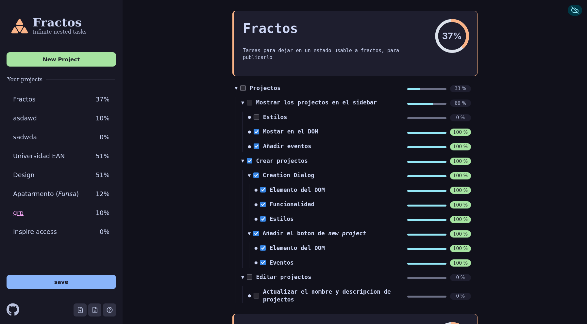

# fractos-web

Fractos is a project and task mannager like any other, 
it allows an infinite nesting of tasks, supports **WYSIWYG markdown** edition 
in titles and descriptions.

> [!tip]
> New realtime sync between devices.
> for this feature you need to self-host the [fractos-srv](https://github.com/glifox/fractos-srv) project.

More features will come in the furute. for now it's on beta.
